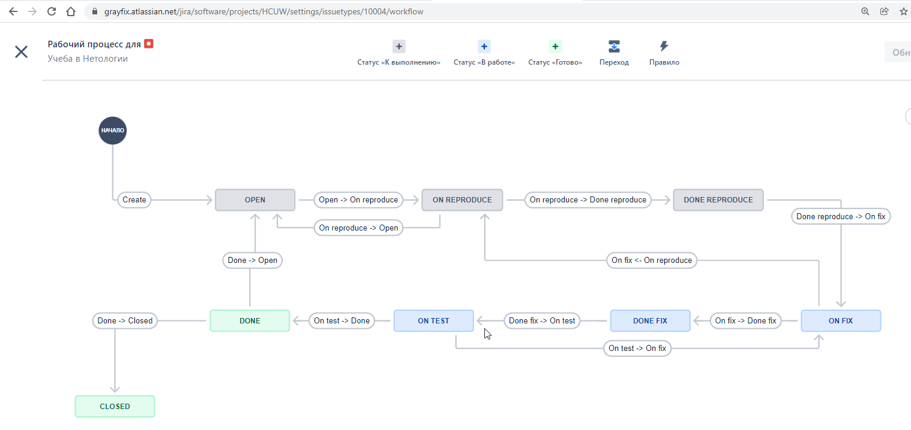
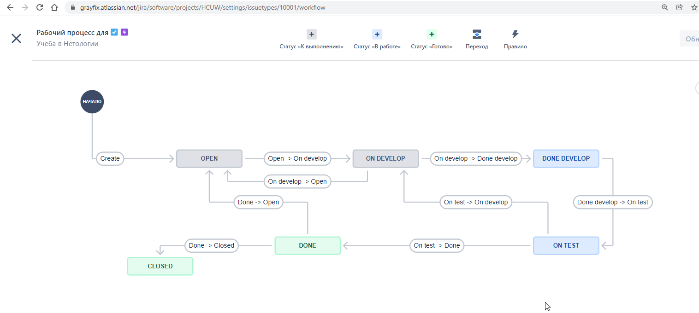

# 09.01 Жизненный цикл ПО

1. Workflow для bug [HCUW-1.xml](HCUW-1.xml)
2. Workflow для epic [Эпик.xml](Эпик.xml)
3. Workflow для задачи 1 в epic [HCUW-3.xml](HCUW-3.xml)
4. Workflow для задачи 1 в epic [HCUW-4.xml](HCUW-4.xml)
5. Схема workflow типа bug 
6. Схема workflow типа task 

