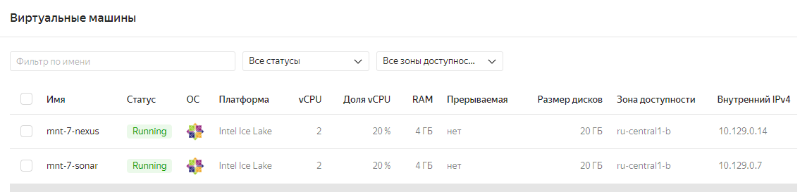
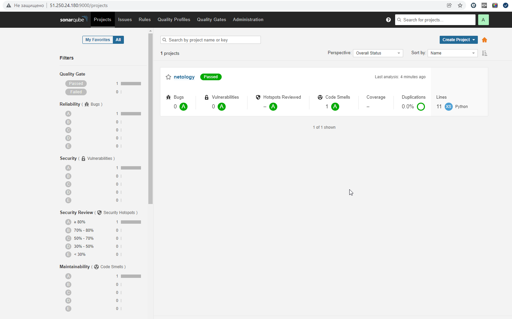
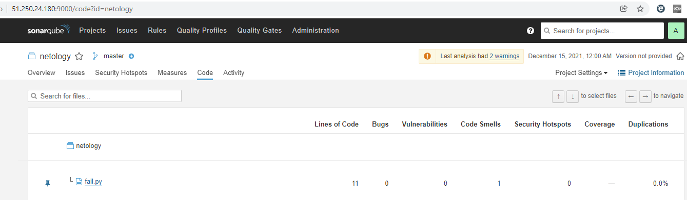
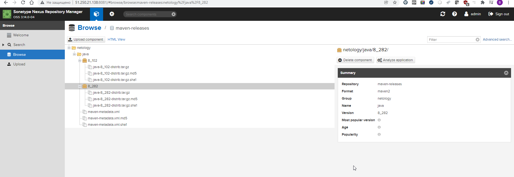

# 09.03 CI\CD

1. Созданные виртуальые машины

2. Скриншоты работы с SonarQube
  
  
3. Исправленный fail.py для SonarQube
  ```python
  def increment(index):
      return index + 1
  def get_square(numb):
      return numb*numb
  def print_numb(numb):
      print("Number is {}".format(numb))
      pass
  
  index = 0
  while (index < 10):
      index = increment(index)
      print(get_square(index))
  ```
4. Ссылка на [maven-metadata.xml](maven-metadata.xml)
5. Ссылка на [pom.xml](pom.xml)
6. Скриншоты загруженных объектов Nexus
   