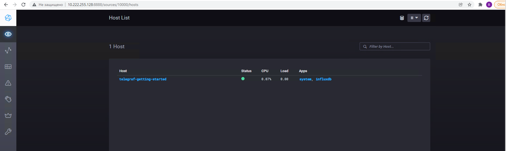
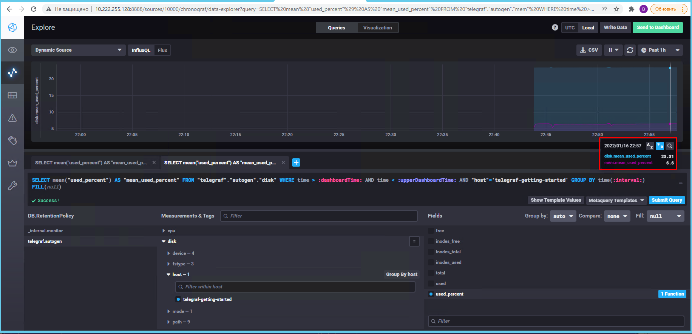
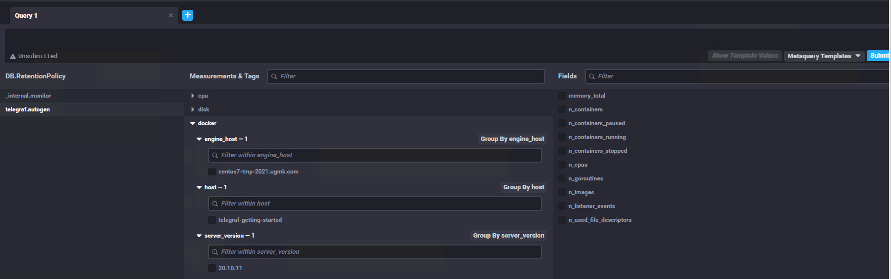
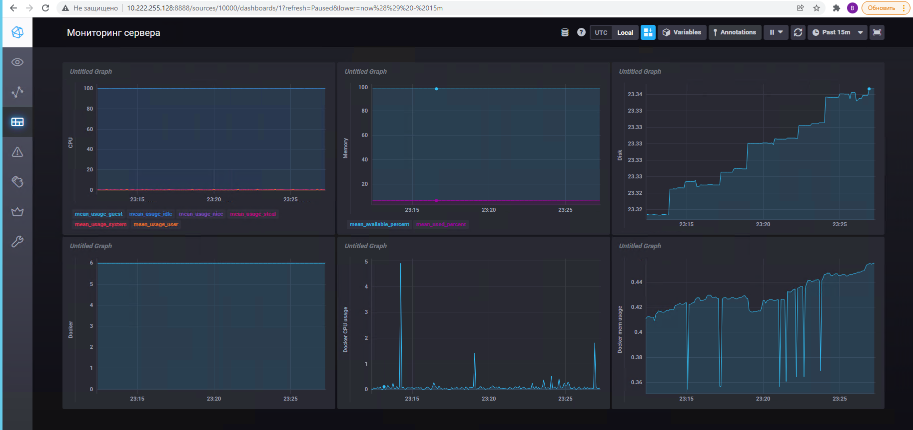

#10.02. Системы мониторинга

1. Плюсы и минусы pull и push
   - Push
     - Плюсы
       - Сервер мониторинга не тратит ресурсы на опрос клиентов
       - Агент можно настроить на отправку метрик в несколько систем мониторинга
     - Минусы
       - Нужен агент мониторинга
       - Настрйоки агента могут храниться локально, это небезопасно (т.к. там могут быть учетные данные для доступа к системам) и трудно отслеживать изменения конфигурации
       - Система мониторинга должна быть в сетевой видимости агента
       - Система мониторинга не отслеживает состояние агента, и нет понимания запущен он или нет
   - Pull
     - Плюсы
       - Возможен мониторинг систем и устройств без агента
       - Система мониторинга может быть в закрытой подсети и взаимодействие с агентами может вестись через прокси
     - Минусы
       - Тратится много ресурсов на опрос клиентов (особенно если клиентов много)

2. Типы систем мониторинга
   - Prometheus - pull
   - TICK - push
   - Zabbix - pull/push
   - VictoriaMetrics - pull/push
   - Nagios - pull. Агентов у него нет, мониторинг идет в основном опросами систем при помощи плагинов.

3. TICK
   - `curl http://localhost:8086/ping` сам по себе вывод пустой, но по логам `influxdb` видно что обращение идет
   ```
    [root@ ~]# curl http://localhost:8086/ping
    [root@ ~]# docker logs -n 5 sandbox_influxdb_1
    [httpd] 172.18.0.4 - - [16/Jan/2022:17:25:10 +0000] "POST /write?consistency=any&db=telegraf HTTP/1.1 " 204 0 "-" "Telegraf/1.21.2 Go/1.17.5" 420768d8-76f1-11ec-b896-0242ac120002 4306
    [httpd] 172.18.0.4 - - [16/Jan/2022:17:25:15 +0000] "POST /write?consistency=any&db=telegraf HTTP/1.1 " 204 0 "-" "Telegraf/1.21.2 Go/1.17.5" 45026d0d-76f1-11ec-b897-0242ac120002 8719
    [httpd] 172.18.0.4 - - [16/Jan/2022:17:25:20 +0000] "POST /write?consistency=any&db=telegraf HTTP/1.1 " 204 0 "-" "Telegraf/1.21.2 Go/1.17.5" 47fd7182-76f1-11ec-b898-0242ac120002 4632
    [httpd] 172.18.0.4 - - [16/Jan/2022:17:25:25 +0000] "POST /write?consistency=any&db=telegraf HTTP/1.1 " 204 0 "-" "Telegraf/1.21.2 Go/1.17.5" 4af88b06-76f1-11ec-b899-0242ac120002 4962
    [httpd] 172.18.0.1 - - [16/Jan/2022:17:25:26 +0000] "GET /ping HTTP/1.1" 204 0 "-" "curl/7.29.0" 4b9b3ef0-76f1-11ec-b89a-0242ac120002 40
   ```
   - `curl http://localhost:8888`
     ```
     <!DOCTYPE html><html><head><meta http-equiv="Content-type" content="text/html; charset=utf-8"><title>Chronograf</title><link rel="icon shortcut" href="/favicon.fa749080.ico"><link rel="stylesheet" href="/src.3dbae016.css"></head><body> <div id="react-root" data-basepath=""></div> <script src="/src.fab22342.js"></script> </body></html>
     ```
   - `curl http://localhost:9092/kapacitor/v1/ping`. Также вывод пустой, в логах обращение есть
    ```
      curl http://localhost:9092/kapacitor/v1/ping
      [root@ ~]# docker logs -n 5 sandbox_kapacitor_1
      ts=2022-01-16T17:30:07.373Z lvl=info msg="http request" service=http host=172.18.0.2 username=- start=2022-01-16T17:30:07.372984Z method=POST uri=/write?consistency=&db=_internal&precision=ns&rp=monitor protocol=HTTP/1.1 status=204 referer=- user-agent=InfluxDBClient request-id=f2c36336-76f1-11ec-9628-000000000000 duration=425.1µs
      ts=2022-01-16T17:30:08.712Z lvl=info msg="http request" service=http host=172.18.0.1 username=- start=2022-01-16T17:30:08.7128139Z method=GET uri=/kapacitor/v1/ping protocol=HTTP/1.1 status=204 referer=- user-agent=curl/7.29.0 request-id=f38fd451-76f1-11ec-9629-000000000000 duration=27µs
    ```
  - Скриншот Хронографа
    
4. Интерфейс Chronograf. Плагины для мониторинга памяти и диска подключены по умолчанию не были. Добавил отдельно в конфигурации `telegraf`. Скриншот с утилизацией памяти и диска в процентах.
  
  
5. Плагин `Docker` для `telegraf`. Прописал настройки, перезапустил docker-compose. Данные плагина
   


# Дополнительное задание
Так и не понял как графики нормально именовать, имена графиков написаны слева по вертикали.

