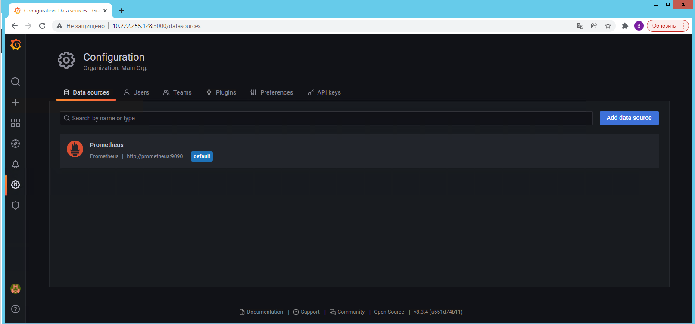
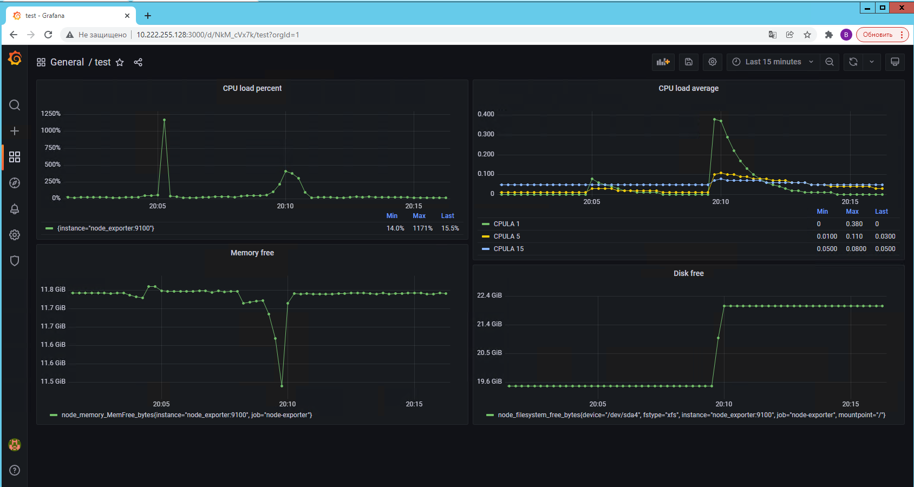
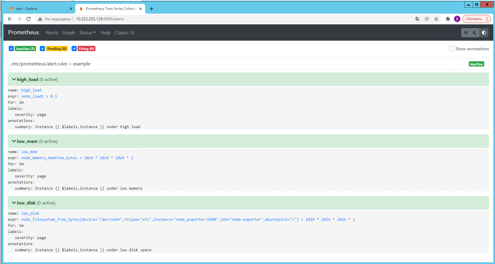

# 10.03. Grafana

1. `Docker-compose` файл написан по примерам найденым в интернете. Ссылка на папку с манифестом и настройками [prometheus](prometheus).  
   Скриншот datasource в Grafana:
   
   
2. promql запросы
   - Утилизация CPU - `100 - (avg by (instance) (rate(node_cpu_seconds_total{job="node-exporter",mode="idle"}[1m])) * 100)`
   - CPULA - `node_load1, node_load5, node_load15`
   - Свободная оперативная память - `node_memory_MemFree_bytes`
   - Места на диске - `node_filesystem_free_bytes`
   - Скриншот дашборда:
   

3. Скриншот настроек алертов в Prometheus
   

4. Ссылка на листинг [дашбоарда](dashboard.json)