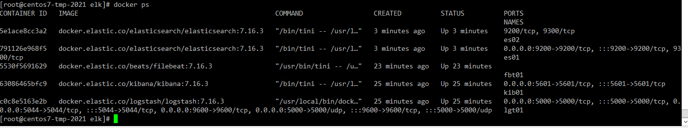
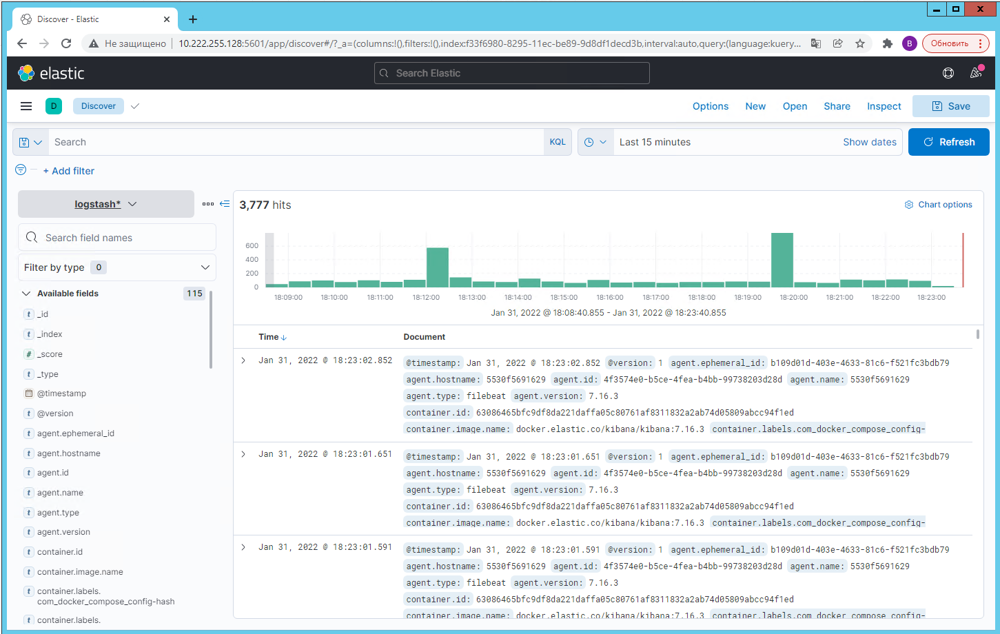

# 10.04. ELK

1. Docker-compose файл собирал самостоятельно
  - Скриншот `docker ps`
  
  - Скриншот интерфейса `kibana`
  
  - docker-compose манифест и файлы [с настройками logstash и filebeat](elk)

2. Т.к. `filebeat` в рабочем состоянии данные в `logstash` и, через него, в `elasticsearch` идут нормально. На скриншоте с интерфейсом `kibana` их видно