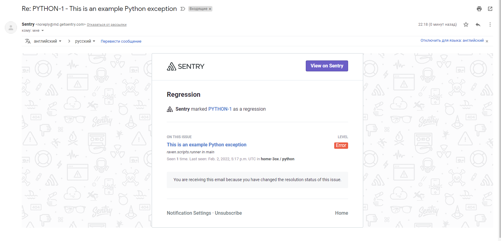
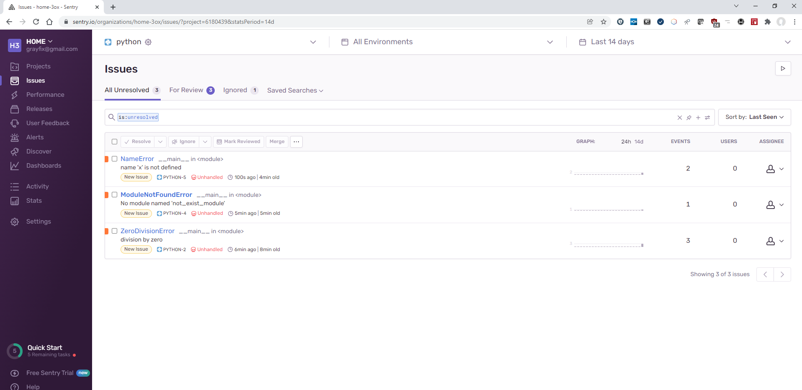

# 10.05. Sentry
1. Скриншот меню Projects
   

2. Скриншот `Stack trace`
   
   

3. Cкриншот тела сообщения
   

4. Задание повышенной сложности. Скриншот меню issue
   

   Пример скрипта
   ```python
    #!/usr/bin/python3
    import sentry_sdk

    sentry_sdk.init(
        "https://2e706772b1ae4e5b9c22f2f5f5049963@o1133672.ingest.sentry.io/6180439",

        # Set traces_sample_rate to 1.0 to capture 100%
        # of transactions for performance monitoring.
        # We recommend adjusting this value in production.
        traces_sample_rate=1.0
    )

    sentry_sdk.set_context("example_cont", {
        "Урок": "10.05. Sentry",
        "type": "Задание повышенной сложности"
    })
    
    # Пример импорта несуществующего модуля
    # import not_exist_module

    # Печать неинициализированной переменной
    print(x)
    
   ```
